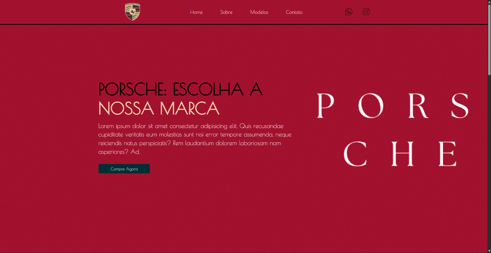

# 🌐 Porsche Simple Website

Projeto feito para testar habilidades de front-end, envolvendo HTML, CSS e um pouco de JavaScript. Como, também, design.

---

## 📸 Preview

  

---

## 🚀 Acesse o projeto

🔗 https://leveslewis.github.io/Porsche-Simple-Website/
---

## 🧠 Sobre o projeto

Foi praticado:

- Estruturação com HTML5
- Personalização com CSS3
- Layout responsivo
- Organização do código
- Design

---

## 🛠️ Tecnologias utilizadas

- HTML5
- CSS3
- JS

---

## 📱 Responsividade

Desenvolvido para funcionar em:

- Desktop

---

## 📂 Estrutura do projeto

Porsche Website/

├── index.html

├── index.css

├── index.js

└── IMG/
